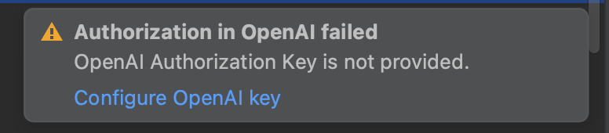

[](https://confluence.jetbrains.com/display/ALL/JetBrains+on+GitHub)
[](https://github.com/JetBrains-Research/llm-guide-refactorings/actions/workflows/gradle-build.yml)

# LLMs guide IDE refactorings

<!-- Plugin description -->
Researching collaboration between LLMs and IDEs to perform automated Extract Function refactoring. It combines the 
power of ChatGPT to provide suggestions about what fragments of code can be extracted from a large function, but leverage
the reliability of IntelliJ IDE to carry out correctly the code transformations.
<!-- Plugin description end -->

### Table of contents

- [Getting started](#getting-started)
- [ChatGPT communication config](#chatgpt-communication-configuration)
- [Trigger Extract Function with ChatGPT](#triggering-extract-function-with-chatgpt)
- [Telemetry Data](#telemetry-data)

## Getting started

- Sign up for OpenAI at https://beta.openai.com/signup
- Get your OpenAI API key
- Go to Settings | Tools | Large Language Models and enter your API key in the "OpenAI Key" field. If you are a member
  of only one organization, leave the "OpenAI Organization" field empty
- Select a code fragment, press Alt-Enter and select "apply custom edit" intention
- Write an instruction for the LLM and wait for the result

## ChatGPT communication configuration

The communication with ChatGPT is achieved through OpenAI API. This API is not for free, and it does require a developer
key. The configuration is very straight forward, all you need to do is to make sure you have the following environment
variables set:

```shell
OPENAI_API_KEY
OPENAI_ORGANIZATION
```

If you forgot to set up your environment variables, when you first try to invoke the Extract Function with ChatGPT,
the following popup will appear:


From here, you can click on *"Configure OpenAI key"* and a new configuration window will show as follows:


## Triggering Extract Function with ChatGPT

To trigger the Extract Function with ChatGPT simply right click inside a function, select *Show Context Action ->
Extract Function Experiment*. This action will automatically select the entire
function, including the doc string, and it will form a ChatGPT prompt. When ChatGPT's reply comes back, a popup window
is shown with the Extract Function candidates so that the developer can choose any of it (or none).

Here's an example of the GUI showing two Extract Function candidates:


Note that in the GUI there are two sub-panels. In the first one there's a list of all the candidates (in the example
abovre there are two).

This list has two components:

1. First is the number of lines of code that would be extracted
2. The name of the new function

Below this list, there's a panel showing the new function's signature. It includes:

1. The access modifiers (private, public, etc.)
2. The name of the function
3. The list of parameters
4. The return value (if any)
5. The body of the function is just three dots (...)

To invoke the actual extraction, you can choose any of the candidates from the list, and you can either hit *Enter*,
*double click*, or press the *Extract* button on the bottom left. If none of the proposed candidates suits your needs,
you can dismiss the popup either by hitting the *Esc* key, or by *clicking* anywhere outside the popup window.

## Telemetry data

Using this plugin for performing Extract Function refactorings will generate telemetry data. This data is going to be
used to understand how developers perform Extract Function and what are their "preferences". Before going any further,
I would like to clarify one thing right from the start: **telemetry data is anonymous, and it's stored only localy on
the user's computer**.

Telemetry data is collected in a file on the local machine of the developer, under the IntelliJ Idea folder
`ef_plugin_logs/ef_telemetry_data.log`. In my case, the full path
is `~/Library/Logs/JetBrains/IntelliJIdea2023.1/ef_plugin_logs/ef_telemetry_data.log`.
The data in stored in *JSON* format as in the following example:

```json
{
  "id": "7161cb82-b2d6-48f4-80ac-c93fbb436c65",
  "hostFunctionTelemetryData": {
    "hostFunctionSize": 25,
    "lineStart": 3,
    "lineEnd": 27,
    "bodyLineStart": 14
  },
  "candidatesTelemetryData": {
    "numberOfSuggestions": 2,
    "candidates": [
      {
        "lineStart": 18,
        "lineEnd": 23,
        "candidateType": "AS_IS",
        "applicationResult": "OK",
        "reason": ""
      },
      {
        "lineStart": 25,
        "lineEnd": 25,
        "candidateType": "AS_IS",
        "applicationResult": "OK",
        "reason": ""
      }
    ]
  },
  "userSelectionTelemetryData": {
    "lineStart": 18,
    "lineEnd": 23,
    "functionSize": 6,
    "positionInHostFunction": 4,
    "selectedCandidateIndex": 0,
    "candidateType": "AS_IS",
    "elementsType": [
      {
        "elementType": "PROPERTY",
        "quantity": 1
      },
      {
        "elementType": "FOR",
        "quantity": 1
      }
    ]
  }
}
```

### What telemetry data contains?

This JSON structure contains the following main categories:

1. Data about the host function:
    * Size of the host function
    * What line does it start/end
2. Data about the generated suggestions and candidates
    * How many suggestions did ChatGPT had
    * What candidates were produced based on the suggestions
    * Line start/end of the candidate
    * Type of the candidate: AS_IS or ADJUSTED (some ChatGPT suggestions need to be adjusted)
    * Whether the candidate can be extracted or not, and if not, what is the reason
3. Data about the user selection

* Which candidate was selected by the developer
* The size of it, and position in host function
* What top level elements type does the selection contain (how many FOR loops, IFs, etc.)

### What telemetry data does NOT contain?

Collected telemetry data does not contain:

* Any information about the user
* Any information about the original functions names
* Any information about variable names
* Any information about the file or the project the user works on
* Any information about the code functionality

Moreover, the telemetry data file or data is not automatically sent anywhere. It exists only on the user's machine,
it's in JSON human-readable format, and the choice of sharing this file with the authors belongs solely to the user.